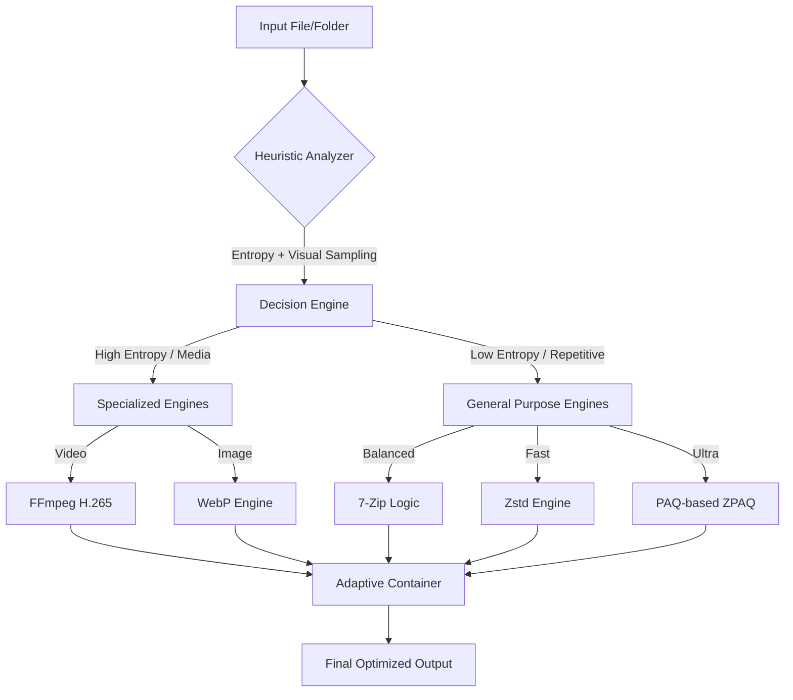

# Intelligent Multi-Modal Adaptive Compression Suite
**B.Tech Final Year Capstone Project**

AdaptivePress is a research-backed file optimization system that leverages AI-driven heuristics to dynamically allocate compression resources. It moves beyond static compression by identifying data modalities (Text, Image, Video, Binaries) and applying the optimal specialized engine in real-time.

## 🏗️ System Architecture

### Intelligent Pipeline Flow


## 🛠️ Graduation Project Features
- **3-2-2 Aggregation Logic**: A specialized consolidation algorithm that groups similar data chunks (Text vs. Binary) into unified streams to maximize dictionary-based efficiency.
- **Network-Aware Dynamic Throttling**: Automatically adjusts compression depth based on ambient network activity to optimize for high-speed uploads.
- **Adaptive Slicing (V3 Pipeline)**: Slices mixed-data files into 4KB aligned blocks for per-block optimization.
- **Hardware-Aware Throttling**: Monitors battery sensors and available RAM to prevent system exhaustion (Eco-Mode).
- **Shannon Entropy Analysis**: Mathematical approach to determine theoretical compressibility limit before execution.
- **Historical Data Persistance**: Integrated SQLite backend for recording experimental metrics and performance auditing.

## 📈 Technical Complexity Analysis
| Module | Algorithm | Time Complexity | Space Complexity |
| :--- | :--- | :--- | :--- |
| **Analyzer** | Shannon Entropy Sampling | O(k) *k=sample size* | O(k) |
| **Slicer** | Sliding Window Protocol | O(n) | O(1) buffer |
| **Selector** | Weighted Multi-Objective Optimization | O(1) | O(1) |
| **V3 Pipeline** | Super-Block Aggregation | O(n) | O(m) *m=block size* |

## 🚀 Installation & Deployment

1. **Setup**:
   ```bash
   pip install -r requirements.txt
   ```
2. **Engines**: Ensure `bin/` contains `7za.exe`, `zstd.exe`, `zpaq.exe`, `cwebp.exe`, and `ffmpeg.exe`.
3. **Execution**: Run `python app.py` and use the **📊 Report** button to export your experimental data for your project viva.

---
*Developed as a B.Tech Final Year project exploring System Optimization and Digital Signal Processing.*
